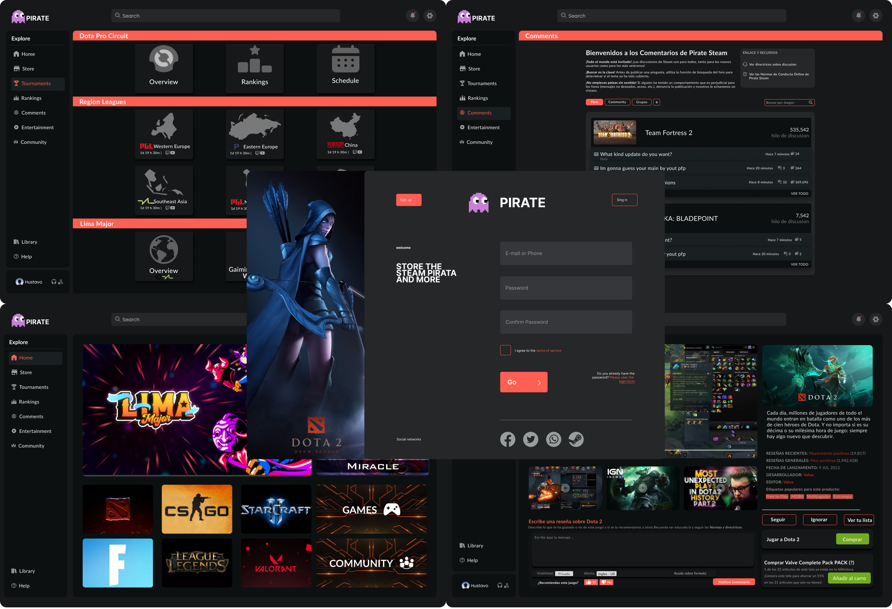

<div align="center">

<div align="center">

```ocaml
MODELO / CONTROL / VISTA
```

```css

█████████████████████████████████████████████████████████████████████
█─▄▄▄▄█─▄─▄─█▄─▄▄─██▀▄─██▄─▀█▀─▄███▄─▄▄─█▄─▄█▄─▄▄▀██▀▄─██─▄─▄─██▀▄─██
█▄▄▄▄─███─████─▄█▀██─▀─███─█▄█─█████─▄▄▄██─███─▄─▄██─▀─████─████─▀─██
▀▄▄▄▄▄▀▀▄▄▄▀▀▄▄▄▄▄▀▄▄▀▄▄▀▄▄▄▀▄▄▄▀▀▀▄▄▄▀▀▀▄▄▄▀▄▄▀▄▄▀▄▄▀▄▄▀▀▄▄▄▀▀▄▄▀▄▄▀
```

</div>

<h1>
  <a href="#--------">
    
  </a>
</h1>

### <sup><sub><samp>HI THERE! THANKS FOR DROPPING BY!</samp></sub></sup>

<picture>
    
</picture>

> El proyecto en cuestión se enfoca en la creación de una tienda virtual similar a Steam, la cual se distingue por una funcionalidad sobresaliente que permite a los usuarios comentar y calificar los juegos adquiridos, obteniendo así una visión general sobre el desempeño y calidad de cada título. Además, se incluirán secciones informativas sobre los Esports, tales como el ranking de jugadores o las competiciones más destacadas, así como una sección de entretenimiento que contendrá videos sobre la jugabilidad y noticias relevantes. 

<h1>
  <a href="#---------1">
</h1>

<br>

<a src="./Mockups"> Mockups </a> 

<a src="./MySQL"> Data Base </a> 